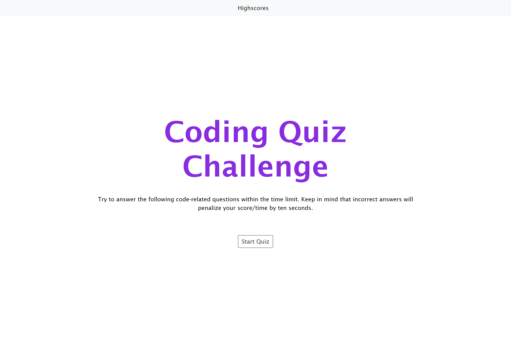

# Password Generator

## Description

I created a web application that functions as a timed quiz on JavaScript concepts. 

## Installation

N/A

## Usage 

This website was created to practice the following skills:
- Javascript
- Deployment to GitHub Pages
- Using Markdown to write a README

#### The work done can be found the GitHub repository [zahirovic/Timed-Quiz](https://github.com/zahirovic/Timed-Quiz)
- The actual product can be found **[here](https://zahirovic.github.io/Timed-Quiz/)** and should look along the lines of this depending on device screen size:

## Credits
- [Markdown Tutorial](https://www.markdowntutorial.com/) for help on basic markdown 

## Features
- JavaScript
 
